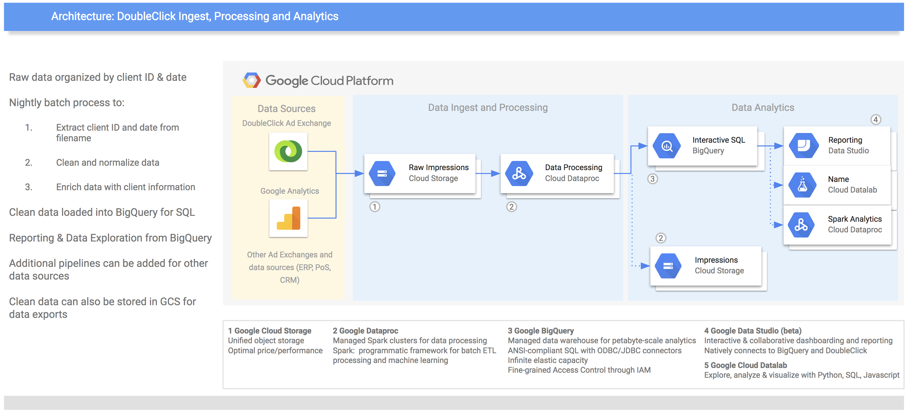
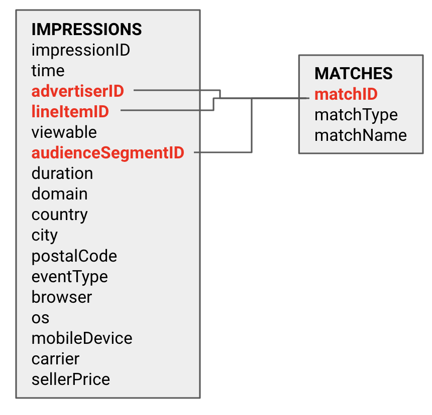
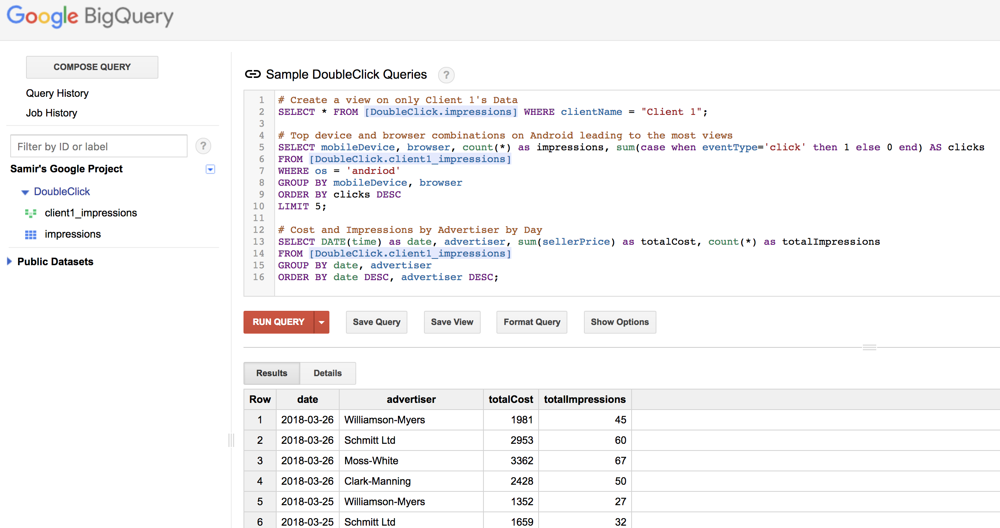
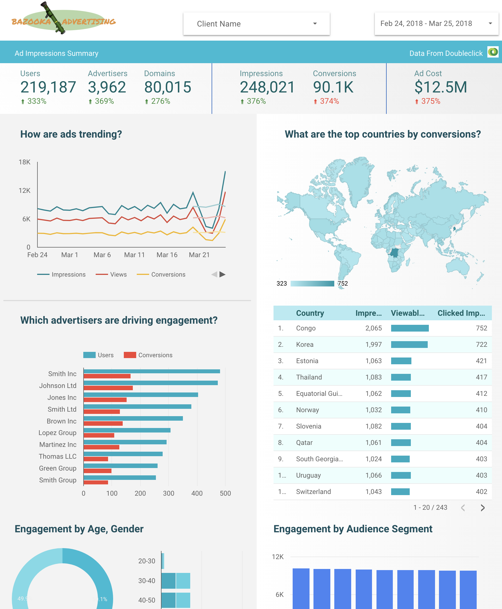

# DoubleClick Analysis in GCP
## Overview
This project simulates the ingest, processing and analysis of DoubleClick impression data using Google Cloud Services. 

## Requirements
* Python 2.7 with the following packages:
  * faker
  * tqdm
  * google.cloud.storage
* Google cloud credentials in a JSON key, with the GOOGLE_APPLICATION_CREDENTIALS environment variable set to the location of the key file. 
* Google Cloud SDK - specifically gsutil, gcloud and bq binaries

### Architecture
The architecture below shows the data flow and components used as part of the solution. 




### Data Generation
A Python data generator is used to simulate impression data being written to CSV files on Google Cloud Storage. These files have the following format:
* Filename: [client ID]/[date]/impressions.csv 
* Fields:
  * **impressionID**: Unique ID
  * **time**: Timestamp when the impression was made
  * **advertiserID**: Unique ID for the advertiser
  * **lineItemID**: Unique ID for the line item of the ad
  * **viewable**: Boolean indicating if the impression was viewed or not
  * **audienceSegmentID**: Unique ID for the audience segment created in DoubleClick
  * **duration**: How long in seconds the impression lasted
  * **domain**: Domain URL from which the impression occured
  * **country**: Country from which the impression occured
  * **city**: City from which the impression occured
  * **postalCode**: Postal code from which the impression occured
  * **eventType**: Type of impression (CLICK or VIEW)
  * **browser**: Browser from which the impression occured (ie. chrome, safari, edge, ...)
  * **os**: Operating system from which the impression occured (ie. iOS, android, ...)
  * **mobileDevice**: Device from which the impression occured (ie. samsung, apple, ...)
  * **carrier**: Mobile carrier from which the impression occured 
  * **sellerPrice**: Price charged for the impression

The data generator also writes a "match" CSV file that matches advertiser, lineItem and audienceSegment IDs with text names for those items. The format is:
* Filename: [client ID]/[date]/match.csv
* Fields:
  * matchType: Type of match (ie. advertiser, lineItem, audienceSegment)
  * matchID: Unique ID to match
  * matchName: Name of the advertiser/lineItem/audienceSegment



NOTE:
* LineItems have the format [size]_[location] - ie. 200x200_bottom left
* Advertisers have the format Advertiser_[ID] - ie. Advertiser_100
* AudienceSegments have the format [gender]_[age]_[descriptor] - ie. M_29_tech savvy

The generator simulates (this can be changed in ```GenerateData.py```:
* 50 clients
* Up to 500 impressions per day per client
* Up to 1M users
* Up to 5 advertisers per client
* Up to 100 line items per client
* Up to 100 audience segments per client

To generate data, run ```python GenerateData.py```

### Data Processing
A Spark job is used to process the current days data from Google Cloud Storage. This involves:
* Parsing date and client ID out of the filename
* Parsing the line items, advertiser names, and audience segments from the matches files and using them to enrich the impressions
* Writing the resulting normalized table to:
  * BigQuery (DoubleClick.impressions dataset) for SQL analytics and reporting
  * Google Cloud Storage (in compressed parquet format) for data exports
  
To create a Google Dataproc Spark cluster, run the PySpark job, terminate the cluster, and load the data into BigQuery - run ```dataproc.sh```
  
### Data Analysis
#### Interactive Querying
Once the data is in BigQuery, you can use standard ANSI SQL to explore the data. A set of sample queries is in ```BigQuery.sql```



#### Reporting and Dashboarding
DataStudio can also be used to generate reports on the data. A sample report can be seen [here](https://datastudio.google.com/open/11Vc0vwdLMIkJ6OW_mIhB0mB-tyfssm23 "DataStudio DoubleClick Report") 

